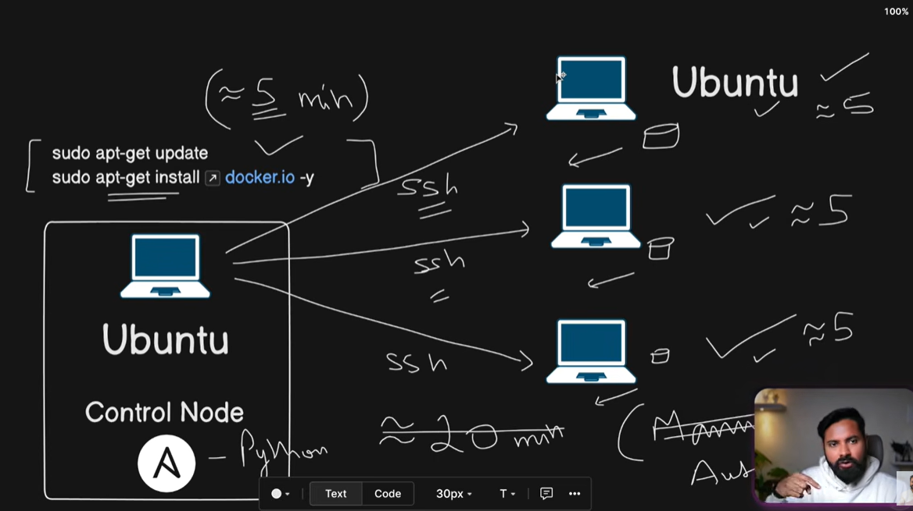

Ansible; configuration as tool hai 

ak master node bnate hia  ya bole ak server isse par ansible install kar dete hia 
# dushre jagh ansible install karne ki jarurat nhi iss leye yeh agentless hai aur yeh pull requestion
yehi sab karo install n all things baki sab sab jagh vhi ho rah hota hia hai.




# ANSIBLE — INTERVIEW NOTES

**Start-to-End • Simple to Learn • Easy to Remember • Interview Ready**

> **IMPORTANT:** This version keeps the complete content of the uploaded PATHNEX Ansible PDF, but reorganizes it into simpler interview-friendly language, memory tricks, and clear examples.

The source covers Ansible definition, why to use it, components, workflow, playbooks, inventory, modules, roles, control node, managed nodes, use cases, examples, benefits, and conclusion.

> **MASTER MEMORY TRICK**
>
> **CONTROL NODE → INVENTORY → PLAYBOOK → MODULES → MANAGED NODES → RESULT**

---

# 1. What is Ansible?

Ansible is an **open-source automation tool** used for:

- Configuration management
- Application deployment
- Task automation

It automates repetitive IT work such as:

- Installing software
- Configuring servers
- Managing many machines

It can be used in:

- On-premises environments
- Cloud environments
- Hybrid environments

### Interview Answer

> **Ansible is an open-source automation tool used for configuration management, application deployment, and task automation. It is agentless and normally communicates with Linux/Unix machines using SSH and Windows machines using WinRM.**

### Memory Trick

**Ansible = AUTOMATE + CONFIGURE + DEPLOY + NO AGENT**

---

# 2. Why Use Ansible?

## 2.1 Simplifies Complex Tasks

Ansible automates tasks that would otherwise require manual intervention.

Examples:

- Setting up a web server
- Updating systems
- Deploying applications

## 2.2 Consistency

Ansible ensures that systems are configured in the same way.

This helps reduce:

- Human errors
- Configuration differences
- Repetitive manual work

## 2.3 Scalability

Ansible can manage:

- One system
- Hundreds of systems
- Thousands of systems

The same configuration can be reused across many machines.

## 2.4 No Agent Required

Ansible does not require a special Ansible agent to be installed on target machines.

Communication:

- **Linux/Unix → SSH**
- **Windows → WinRM**

### Interview Answer

> **I use Ansible when I need the same configuration or operational task to be performed consistently across multiple servers. Its agentless approach makes setup simple because the target machines do not need a dedicated Ansible agent.**

### Memory Trick

**Why Ansible? → EASY + CONSISTENT + SCALABLE + AGENTLESS**

---

# 3. Basic Components of Ansible

The important components covered in the source are:

1. Playbooks
2. Inventory
3. Modules
4. Roles

---

## 3.1 Playbooks

Playbooks are the **core files** where we define the tasks Ansible should execute.

They are written in **YAML**.

YAML is:

- Human-readable
- Easy to understand

A playbook contains one or more **plays**.

A play defines:

- What actions should be performed
- On which group of systems

### Interview Answer

> **A playbook is a YAML file that describes the desired sequence of tasks and the hosts on which those tasks should run.**

### Memory Trick

**Playbook = WHAT TO DO + WHERE TO DO IT**

---

## 3.2 Inventory

An inventory is the list of:

- Servers
- Hosts
- IP addresses
- Hostnames

that Ansible manages.

Inventory can be:

### Static Inventory

A simple file containing hostnames or IP addresses.

Example:

```ini
[webservers]
server1.example.com
server2.example.com
```

### Dynamic Inventory

Inventory can also be generated dynamically by a cloud service such as AWS.

### Interview Answer

> **Inventory tells Ansible which machines it can manage and lets us group hosts, such as webservers.**

### Memory Trick

**Inventory = WHERE / ON WHICH SERVERS**

---

## 3.3 Modules

Modules are used to perform the **actual work** on managed systems.

Examples of work performed by modules:

- Installing software
- Creating files
- Managing services
- Copying files

The source specifically gives:

- `yum` module → installing packages on RedHat-based systems
- `copy` module → copying files from a local machine to a remote server

### Example

```yaml
- name: Install nginx
  yum:
    name: nginx
    state: present
```

### Interview Answer

> **Modules are the execution units Ansible uses to perform tasks on managed systems—for example, installing packages, copying files, or managing services.**

### Memory Trick

**Module = ACTUAL WORK**

---

## 3.4 Roles

A role is a way of organizing playbooks into **reusable units**.

A role is like a structured folder containing things related to a specific function:

- Tasks
- Templates
- Files
- Variables

Examples:

- Web server role
- Database role

### Interview Answer

> **A role is a reusable way to organize Ansible automation for a specific function, keeping related tasks, templates, files, and variables together.**

### Memory Trick

**Role = REUSABLE PACKAGE / ORGANIZED PLAYBOOK**

---

# 4. How Ansible Works

Ansible follows a simple flow.

## Step 1 — Connect

Ansible connects to the target systems.

For:

- Linux/Unix → SSH
- Windows → WinRM

## Step 2 — Execute

Ansible sends the required modules/commands to perform tasks.

Examples:

- Installing software
- Modifying files
- Starting services
- Stopping services

## Step 3 — Report

Ansible returns the output.

It reports whether each task:

- Succeeded
- Failed

### Interview Answer

> **Ansible connects to the target, executes the required modules, and returns the result. For Linux/Unix it uses SSH; for Windows it uses WinRM.**

### Memory Trick

**CONNECT → EXECUTE → REPORT**

---

# 5. Core Components

## 5.1 Control Node

The machine from where Ansible is run.

It can be:

- Your local machine
- A dedicated server

### Remember

**Control Node = BRAIN**

---

## 5.2 Managed Nodes

The remote systems that Ansible manages.

They may be:

- Servers
- Cloud instances
- Virtual machines

### Remember

**Managed Node = TARGET**

---

## 5.3 Playbooks

Playbooks define:

- Tasks to automate
- Machines on which those tasks should execute

### Interview Answer

> **The control node runs Ansible. The managed nodes are the target systems. The playbook defines the work to perform on those targets.**

### Memory Trick

**CONTROL NODE = BRAIN**

**MANAGED NODE = TARGET**

**PLAYBOOK = INSTRUCTIONS**

---

# 6. Basic Ansible Workflow

The source describes a three-step workflow.

---

## Step 1 — Write a Playbook

Example: Set up a web server.

```yaml
---
- name: Set up a web server
  hosts: webservers
  tasks:
    - name: Install Nginx
      yum:
        name: nginx
        state: present

    - name: Start Nginx service
      service:
        name: nginx
        state: started
        enabled: yes
```

This playbook:

1. Targets the `webservers` group
2. Installs Nginx
3. Starts the Nginx service
4. Enables the service

---

## Step 2 — Execute the Playbook

Run the playbook using:

```bash
ansible-playbook -i inventory_file webserver.yml
```

### Meaning

- `ansible-playbook` → command used to execute a playbook
- `-i` → specifies inventory
- `inventory_file` → inventory
- `webserver.yml` → playbook

---

## Step 3 — Verify the Results

After running the playbook, Ansible returns the status of each task.

You can see whether tasks:

- Succeeded
- Failed

### Interview Answer

> **My basic workflow is: create inventory, write the YAML playbook, run it with ansible-playbook, and verify the task results.**

### Memory Trick

**WRITE → RUN → VERIFY**

---

# 7. Common Use Cases of Ansible

The source covers five major use cases:

1. System Configuration
2. Application Deployment
3. Provisioning Cloud Resources
4. Patch Management
5. Infrastructure as Code

---

## 7.1 System Configuration

Ansible can automate:

- Creating users
- Creating groups
- File permissions
- Installing software
- Configuring software

Examples:

- Nginx
- Apache
- MySQL

### Simple Interview Line

> **I can use Ansible to configure users, permissions, software packages, and services consistently across multiple servers.**

---

## 7.2 Application Deployment

Ansible can be used for:

- Deploying code
- Production deployment
- Staging deployment
- Database configuration
- Web-server configuration

### Simple Interview Line

> **Ansible can automate application deployment and configure the supporting database and web-server environment.**

---

## 7.3 Provisioning Cloud Resources

Ansible can automate creation and management of cloud resources.

The source mentions:

- AWS
- Google Cloud
- Azure

Using Ansible cloud modules, we can automate:

- Creating instances
- Setting up security groups
- Configuring networking

### Simple Interview Line

> **Ansible can also automate cloud resource operations such as creating instances, configuring security groups, and networking.**

---

## 7.4 Patch Management

Ansible can automate:

- Software updates
- Package updates
- Patches

across multiple systems.

### Simple Interview Line

> **I can use Ansible to apply regular software updates and patches consistently across multiple servers.**

---

## 7.5 Infrastructure as Code — IaC

Infrastructure configuration can be treated as code.

This allows configuration to be:

- Versioned
- Stored
- Reused

This is useful in:

- DevOps
- CI/CD pipelines

### Simple Interview Line

> **Ansible can be used to manage infrastructure configuration as code so that the configuration can be versioned, stored, and reused.**

### Memory Trick

**Use Cases = CONFIGURE → DEPLOY → CLOUD → PATCH → IaC**

---

# 8. Example Use Case — Installing Nginx

The source gives Nginx installation as a simple Ansible task.

The process is:

### Step 1

Create an inventory file.

Example:

```ini
[webservers]
server1.example.com
server2.example.com
```

### Step 2

Write a playbook.

```yaml
---
- name: Set up a web server
  hosts: webservers
  tasks:
    - name: Install Nginx
      yum:
        name: nginx
        state: present

    - name: Start Nginx service
      service:
        name: nginx
        state: started
        enabled: yes
```

### Step 3

Execute it.

```bash
ansible-playbook -i inventory_file webserver.yml
```

### Step 4

Check the result.

Verify whether the Nginx installation and service task succeeded.

### Interview Answer

> **For a simple Nginx automation, I define the target servers in inventory, create a playbook with installation and service tasks, run the playbook, and verify the result.**

### Memory Trick

**INVENTORY → PLAYBOOK → RUN → VERIFY**

---

# 9. Complex Task — Setting Up a Web Application Stack

For a more complex scenario, Ansible can be used to deploy a complete application stack.

The source gives two examples.

## LAMP

**LAMP =**

- Linux
- Apache
- MySQL
- PHP

## MEAN

**MEAN =**

- MongoDB
- Express
- Angular
- Node.js

The purpose is to automate:

- Configuration of multiple servers
- Installation/configuration of software
- Complete software stacks
- Repeatable environments

### Interview Answer

> **For a multi-tier application stack, I can use Ansible to automate the configuration of multiple servers and the required software stack so the environment can be reproduced consistently.**

### Memory Trick

**Simple Task = ONE SERVICE**

**Complex Task = COMPLETE STACK**

---

# 10. Benefits of Ansible

The source specifically mentions the following benefits.

---

## 10.1 Simplified Infrastructure Management

Ansible can automate system administration tasks.

Instead of manually configuring every machine, we define automation once and apply it consistently.

---

## 10.2 Learning Automation and DevOps Practices

Ansible is useful for learning and implementing:

- Automation
- DevOps practices

---

## 10.3 Clear Syntax and Easy Learning Curve

Ansible uses YAML-based playbooks.

The syntax is:

- Human-readable
- Easy to learn
- Easy to understand

### Interview Answer

> **The main benefits are simpler infrastructure management, repeatable automation, consistency across systems, scalability, and an agentless architecture.**

### Memory Trick

**Benefits = SIMPLE + REPEATABLE + CONSISTENT + SCALABLE + EASY YAML**

---

# 11. Conclusion

By using Ansible, we can automate many common IT tasks.

Examples include:

- Installing software
- Configuring systems
- Deploying applications
- Managing many systems

It is an important skill for modern:

- IT infrastructure management
- System administration
- DevOps

Its simplicity and power make it useful for both:

- Beginners
- Advanced learners

### Interview Answer

> **Ansible helps automate common IT and DevOps tasks in a simple, repeatable way, from software installation and configuration to application deployment across multiple systems.**

---

# 12. One-Minute Interview Revision

If the interviewer asks:

> **“Tell me about Ansible.”**

Use this structure:

```text
Ansible
   ↓
Open-source automation tool
   ↓
Configuration + Deployment + Task Automation
   ↓
Agentless
   ↓
SSH (Linux/Unix) / WinRM (Windows)
   ↓
Inventory → Playbook → Modules
   ↓
Control Node → Managed Nodes
   ↓
Connect → Execute → Report
   ↓
Use cases:
Config → Deployment → Cloud → Patching → IaC
```

## Ready-to-Speak Interview Answer

> **Ansible is an open-source, agentless automation tool used for configuration management, application deployment, and task automation. I run it from a control node and manage target systems listed in inventory. The automation is defined in YAML playbooks, and modules perform the actual tasks. Ansible connects through SSH for Linux/Unix or WinRM for Windows, executes the tasks, and reports the results. Typical use cases include system configuration, application deployment, cloud provisioning, patch management, and Infrastructure as Code.**

---

# 13. Fast Memory Map

| Concept | Remember It As | Key Detail |
|---|---|---|
| Ansible | **AUTOMATION** | Config + deployment + tasks |
| Agentless | **NO AGENT** | SSH / WinRM |
| Control Node | **BRAIN** | Runs Ansible |
| Managed Node | **TARGET** | Remote server/VM/cloud instance |
| Inventory | **WHERE** | Hosts / groups |
| Playbook | **WHAT** | YAML instructions |
| Module | **DO** | Performs actual task |
| Role | **REUSE** | Organized reusable unit |
| Workflow | **CER** | Connect → Execute → Report |
| Use Cases | **CDCPA** | Config → Deploy → Cloud → Patch → IaC |

---

# 14. Interview Traps to Avoid

## Trap 1 — Agent

Do **not** say:

> “Ansible requires an agent on every server.”

The source explicitly describes Ansible as **agentless**.

Remember:

```text
Linux/Unix → SSH
Windows    → WinRM
```

---

## Trap 2 — Inventory vs Playbook

Do not confuse them.

### Inventory

Tells Ansible:

> **WHERE / WHICH MACHINES**

### Playbook

Tells Ansible:

> **WHAT TO DO**

Memory:

```text
Inventory = WHERE
Playbook  = WHAT
```

---

## Trap 3 — Playbook vs Module

Do not confuse them.

### Playbook

Defines and organizes the tasks.

### Module

Performs the actual operation.

Memory:

```text
Playbook = Instructions
Module   = Worker
```

---

## Trap 4 — Roles

Do not describe a role as just one task.

A role organizes reusable:

- Tasks
- Templates
- Files
- Variables

for a particular function.

Memory:

> **Role = Reusable organized automation**

---

## Trap 5 — Communication

Always remember:

```text
Linux/Unix → SSH
Windows    → WinRM
```

---

# 15. Complete Ansible Mental Model

When you hear **Ansible**, mentally walk through this:

```text
                 ANSIBLE
                    |
                    ↓
             Automation Tool
                    |
        +-----------+-----------+
        |           |           |
        ↓           ↓           ↓
   Configuration Deployment  Tasks
                    |
                    ↓
               Agentless
                    |
          +---------+---------+
          |                   |
          ↓                   ↓
        SSH                  WinRM
     Linux/Unix             Windows
                    |
                    ↓
              CONTROL NODE
                    |
                    ↓
               INVENTORY
                    |
                    ↓
               PLAYBOOK
                    |
                    ↓
                MODULES
                    |
                    ↓
             MANAGED NODES
                    |
                    ↓
              TASK RESULT
             Success/Failure
```

---

# 16. Final Interview Formula

For almost any basic Ansible question, remember:

```text
WHAT?
   ↓
Ansible is an automation tool.

WHY?
   ↓
Automation + Consistency + Scalability + No Agent.

COMPONENTS?
   ↓
Control Node + Managed Nodes + Inventory + Playbook + Modules + Roles.

HOW?
   ↓
Connect → Execute → Report.

COMMUNICATION?
   ↓
SSH / WinRM.

USE CASES?
   ↓
Configuration + Deployment + Cloud + Patching + IaC.

EXAMPLE?
   ↓
Install and start Nginx on multiple servers.
```

### Final Master Trick

> **“Ansible tells WHAT to do, inventory tells WHERE, modules DO the work, control node RUNS it, managed nodes RECEIVE it, and Ansible REPORTS the result.”**

---

# 17. Source Coverage Check

This study document intentionally covers every section present in the uploaded PATHNEX document:

- Ansible definition
- Open-source automation
- Configuration management
- Application deployment
- Task automation
- On-premises/cloud/hybrid environments
- Agentless architecture
- SSH
- WinRM
- Why Ansible
- Simplifying complex tasks
- Consistency
- Scalability
- No agent requirement
- Playbooks
- YAML
- Plays
- Inventory
- Static inventory
- Dynamic inventory
- Modules
- `yum`
- `copy`
- Roles
- Tasks
- Templates
- Files
- Variables
- How Ansible works
- Control Node
- Managed Nodes
- Basic workflow
- Writing a playbook
- Executing a playbook
- `ansible-playbook`
- Verifying results
- System configuration
- Application deployment
- Cloud provisioning
- AWS
- Google Cloud
- Azure
- Patch management
- Infrastructure as Code
- CI/CD
- Nginx example
- LAMP
- MEAN
- Benefits
- Conclusion

The original material is reorganized rather than intentionally removed, with interview answers and memory aids added to make revision easier.

---

# FINAL 30-SECOND REVISION

```text
Ansible
= Open-source automation tool

Used for:
Configuration + Deployment + Task Automation

Special point:
Agentless

Communication:
Linux/Unix → SSH
Windows    → WinRM

Main things:
Control Node
Managed Nodes
Inventory
Playbook
Modules
Roles

Workflow:
Connect → Execute → Report

Inventory:
WHERE

Playbook:
WHAT

Module:
DO

Role:
REUSE

Use Cases:
Configuration
Deployment
Cloud
Patching
IaC

Example:
Install + Start Nginx on multiple servers.
```

> **If you remember only one sentence:**
>
> **“Ansible is an agentless automation tool where the control node uses inventory to identify managed nodes, playbooks define what to do, modules perform the work, and Ansible reports the result.”**
