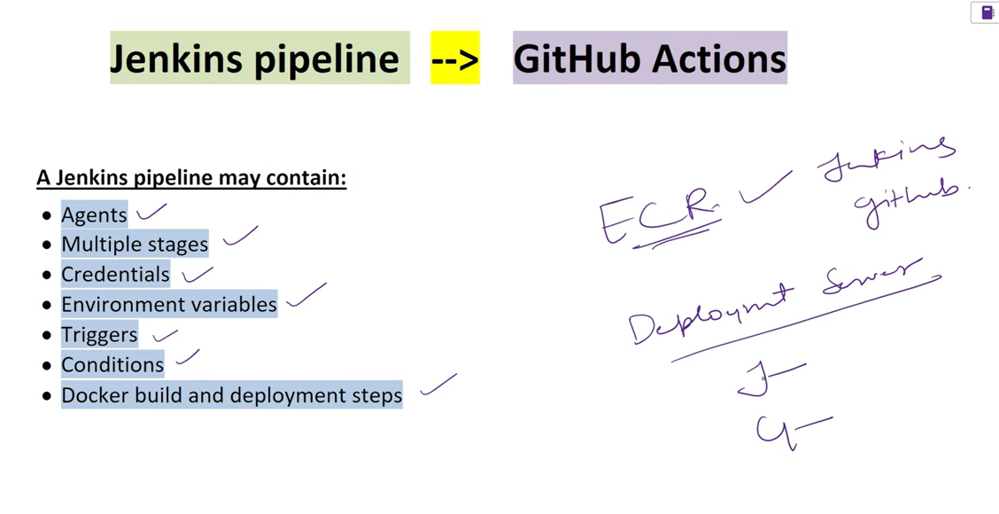
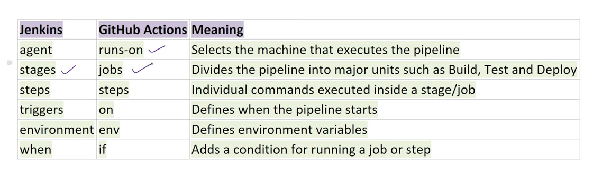
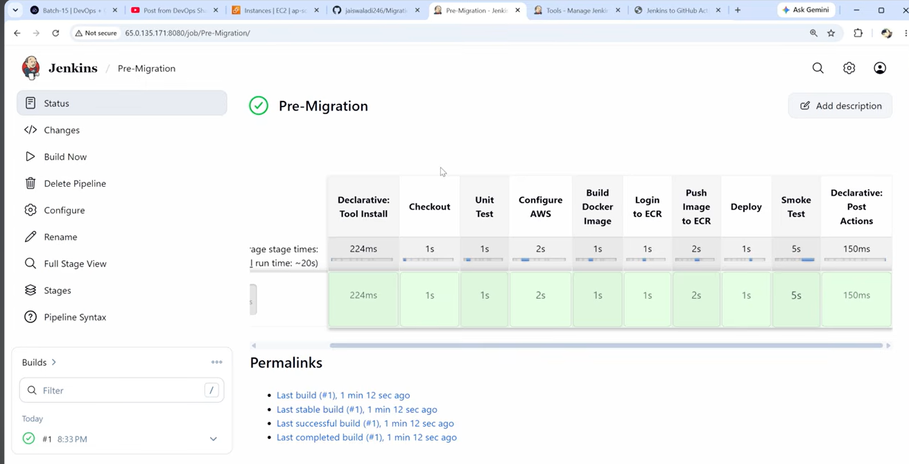
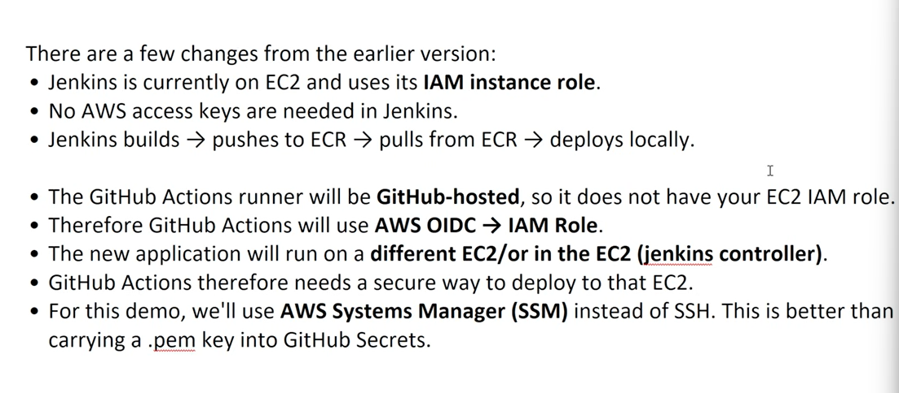
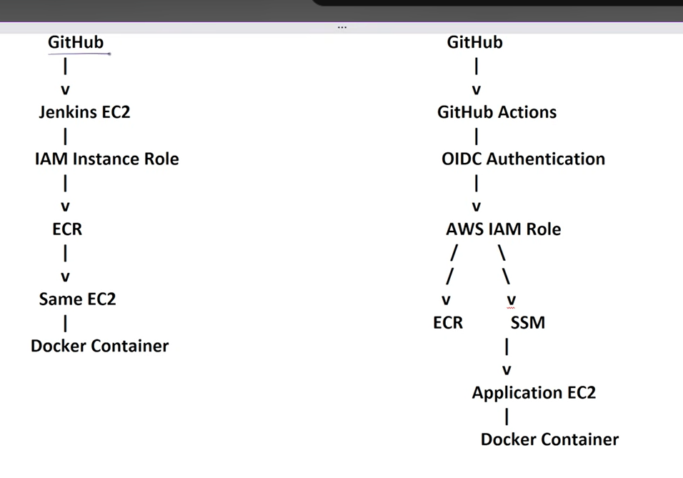

#  Jenkins to GitHub Actions Step by Step

while migrating keep in that server and image uypload (ecr) will be same 

Rest as same as jenkin we convert the code in github actions.

1. cretae jenkins ec2
2. create ecr(jfrog for other)
3. create iam role for jenkins ec2 and ecr.

## why jenkins ec2 created 
The *Jenkins EC2* machine was created to serve as the **central CI/CD automation server** for the project (0:08-0:09). 

Its specific roles included:
* **Hosting Jenkins:** Running the *Jenkins* application to manage the CI/CD pipeline stages (0:45).
* **Building and Deployment:** Acting as the primary environment to build *Docker* images, pull them from the *Elastic Container Registry (ECR)*, and execute the final deployment of the application container (0:47, 33:20-34:58).
* **Access Management:** By attaching an *IAM Role* to this *EC2* instance, it gained secure, credential-less permissions to interact directly with *ECR* to push and pull container images without needing to store sensitive access keys on the server (10:00-10:56, 41:46-42:12).

## whi iam role created and why only attach to ec2 why not ecr insde attach 
The **IAM role** was created to establish a **secure, credential-less authentication method** for the CI/CD pipeline (10:00 - 10:56). By using an IAM role instead of hardcoding sensitive secret keys, the system ensures that the automation server remains secure while maintaining necessary access to AWS resources.

**Why attach the role to the EC2 instance?**
The EC2 instance is the **active actor** in this architecture. Because the *Jenkins* application (or the deployment commands) runs on this machine, the EC2 instance needs the *permission* to initiate actions, such as pushing Docker images to or pulling them from *ECR* (10:08 - 10:17).

**Why not attach the role to ECR?**
*ECR (Elastic Container Registry)* is a **passive storage resource**; it is the destination for images, not the initiator of the process. In AWS, permissions work by granting an **identity** (like an EC2 instance or a user) the authority to perform actions *on* a resource (like ECR). Attaching a role to ECR would not help the EC2 instance gain the authority to push or pull; rather, the EC2 instance must be granted the policy to interact with the ECR registry (10:05 - 10:14).

=================================
Yes, the project follows exactly that workflow. The video demonstrates a **two-phase migration strategy** to move from *Jenkins* to *GitHub Actions* while keeping the underlying process and infrastructure intact.

1. **Phase 1: Jenkins Setup (0:00 - 40:00):** You first build a fully functional CI/CD pipeline using *Jenkins* hosted on an *EC2* instance. This includes setting up an *ECR* registry, configuring *IAM* roles for secure access, and verifying application deployment and smoke tests.
2. **Phase 2: Migration to GitHub Actions (40:35 - 1:16:18):** You then migrate the pipeline to *GitHub Actions*. This involves replacing the server-based *Jenkins* orchestration with *GitHub-hosted runners*, implementing *OIDC* (OpenID Connect) for secure *AWS* authentication, and using *SSM* (Systems Manager) for remote deployment command execution on the *EC2* instance.

The goal is to prove that the **CI/CD process can be fully converted** without breaking the deployment workflow or requiring infrastructure changes on the target *EC2* server.

=====================================================

==========================================
# now converting pipelines

1. own vm  or github free vm free one
2. uses aws oidc for iam role bcoz in github actions we cannot attach directly iam role like we do in jenkins

